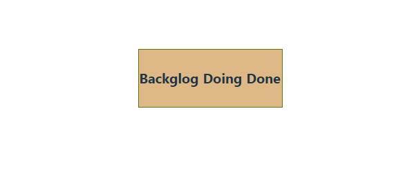

# 01 Board

We are going to create a simple Kanban example, the goal of this example is to learn how the library works, for a more elaborated example, you can visit the [official atlassian demo](https://atlassian.design/components/pragmatic-drag-and-drop/examples/#board).

# Step by step

This example takes the _00-boilerplate_ as a starting point, you can copy it to a given folder and execute `npm install` and then `npm run dev`.

In this step we will implement a simple static kanban board:


## Data model and api

Let's start by checking what data structure we will need:

- A _kanban_ board is going to have a list of columns.

- A list of columns is going to have a list of tasks/stories (we can call them cards)

- A card, as starting point, is going to be defined in a very simple way, just with an _id_ and a title.

_Hey but in my real application I have more fields or different fields, what can do we do?_

- At first we want to play with the library and grasp the basics, we can worry about this details later.

- Once we go for the real implementation, the first thing is to create a _mapper_, ie a function that transforms from the domain of my application to the domain of entities of the _kanban_ and vice versa, so we do not taint the implementation of the _kanban_ with specific issues of my application, which then make it more difficult to use it in other applications or even in the same _app_ with other entities.

- We have to think about scenarios:

  - Maybe we are clear that we want to have title, description of the _card_ and little more, in this case we map entities and at most add a field “_object_” or “_data_” in which we have the original entity (this could be looked at typing with generics).

  - Maybe we want a rich edition in the card or provide a flexible layout, an option could be to pass as _children_ or in props the component that we want to paint in the _card_ in particular.

> Be careful with the Meta Meta and going to super generic solutions, the more we
> head in that direction the complexity curve of the component skyrockets.
> it is necessary to find the right measure between going generic and gettings a code base easy to
> maintain (or if you have to go super generic solution then it should because of business needs),
> my advice here is: "Before creating the mold for the vase, you need to make several vases first."

So for the moment we create the following model, first we define an _item_ (_card_):

_./src/kanban/model.ts_

```ts
export interface CardContent {
  id: number;
  title: string;
}
```

Let's go now for the column:

- It has a title.
- It has a list of letters.

_./src/kanban/model.ts_

```diff
export interface CardContent {
  id: number;
  title: string;
}

+ export interface Column {
+  id: number;
+  name: string;
+  content: CardContent[];
+ }
```

And now we define the Kanban entity, which for now we set as a list of columns.

_./src/kanban/model.ts_

```diff
export interface CardContent {
  id: number;
  title: string;
}

export interface Column {
  id : number;
  name: string;
  content: CardContent[];
}

+ export interface KanbanContent {
+  columns: Column[];
+ }
```

- And finally, _KanbanContent_ will be the entry point entity that we will instantiate in our component, so it is better to have a function to instantiate an empty _kanban_ that serves as a safe entry point (we create a _factory_), by following this approach we avoid doing null field checks, etc...

_./src/kanban/model.ts_

```diff
export interface KanbanContent {
  columns: Column[];
}

+ export const createDefaultKanbanContent = (): KanbanContent => ({
+  columns: [],
+ });
```

It is time to create a mock api to load the data (we will add some mock data), things to be taken into account:

- The api must have the same signature as if we were loading data from an _REST API_ (async and promises), so when we replace the _mock_ with real data we are only going to have to make the updates in the API.

- We will define the _mock_ data in a separate file, so it is easier to delete and we don't add extra noise to the codebase.

At the moment both api and _mock_ are going to be defined inside the _kanban_ component, in the final implementation we will probably take it out of the folder (it will be directly in the application page that request the data to a server, we will pass the results to _mapper_ and will convert from specific app entities to my kanban entities), but we are not going to get involved into this right now, better not to add more elements into the equation and raise the complexity right now, let's focus on solving issues step by step: first we crawl, then walk and finally run. (remider: it's important that this project is an _spike_ and we will have 2/3 with to play with it without pressure)

The _mock_ data:

_./src/kanban/mock-data.ts_

```ts
import { KanbanContent } from "./model";

// TODO: Move this in the future outside the kanban component folder
export const mockData: KanbanContent = {
  columns: [
    {
      id: 1,
      name: "Backglog",
      content: [
        {
          id: 1,
          title: "Crear las cards",
        },
        {
          id: 2,
          title: "Colocar las cards",
        },
        {
          id: 3,
          title: "Implementar drag card",
        },
        {
          id: 4,
          title: "Implementar drop card",
        },
        {
          id: 5,
          title: "Implementar drag & drop column",
        },
      ],
    },
    {
      id: 2,
      name: "Doing",
      content: [
        {
          id: 6,
          title: "Delete a card",
        },
      ],
    },
    {
      id: 3,
      name: "Done",
      content: [
        {
          id: 7,
          title: "Crear el boilerplate",
        },
        {
          id: 8,
          title: "Definir el modelo de datos",
        },
        {
          id: 9,
          title: "Crear las columnas",
        },
      ],
    },
  ],
};
```

> When we have code or implementations that need a wiggle, it is a good idea to add a `TODO` so that when a Pull Request is raised, all these `TODO's` will popup, and by then we can suggest a solution.

- And now let's define the API

_./src/kanban/kanban.api.ts_

```ts
import { KanbanContent } from «./model»;
import { mockData } from «./mock-data»;

// TODO: Mover esto fuera de la carpeta de componentes kanban
export const loadKanbanContent = async (): Promise<ContenidoKanban> => {
return mockData;
};
```

Why don't we just embed the data directly into the _container_ ? It is important that the UI part is left with as little noise as possible, and it is good practice to remove as much code as possible that does not have to do with UI, and extract them to plain vanilla TS files, by following this approach:

- This will help avoiding the component to become a monster: the typical file with 5000 lines of code, with a truly _sphaguetti_.

- By isolating code in a TS file we already know that it is not dependent on `React` and a colleague who does not know `React` could work on that part without problems, or reuse it on a `Node.js` server or `Vue` application, etc...

- It is easier to test, we have parts that do one thing and one thing only.

### Components

Let's start working on the UI

- Let's define the _kanban_ container, first let's add some basic styling:

The container div:

- It's going to be a flexbox.
- It takes up all the available space.
- The columns will be shown from left to right, leaving a gap between them.
- We also add an _overflow hidden_ (if there were more cards than space in the column right now the overflow will be hidden but we could configure e.g. scroll behavior),

_./src/kanban/kanban.container.module.css_

```css
.container {
  display: flex;
  flex-direction: row;
  flex: 1;
  column-gap: 5px;
  min-width: 0;
  width: 100%;
  height: 100%;
  overflow: hidden;
  border: 1px solid rgb(89, 118, 10);
  background-color: burlywood;
}
```

Take into account that:

- This is not going to be the final design, but we focus on the main issue... resolving drag and drop, before starting with the bells and whistles (when the test is a success, we will worry about refined styling, rem, media queries, etc...).

- The same happens with colors, theming..., we will start very simple, and later on we could just expose some theming api or whatever suits the best.

If you may have noticed, there are a lot of decisions that could add unnecesary noise to our proof of concept, our goal as software developers / architects is to delay all decisions that are not essential and focus on the core of our POC (altough is a good idea to note down everything that comes along the way, just to take account later once the POC core is done also to tell pending stuff in _spkie_ demo and add it to _user story_ of real implementation. Could be very dangerous to show a demo where everything is functional and a non-technical could think everything is already done).

Let's define the container component:

_./src/kanban/kanban.container.tsx_

```tsx
import React from "react";
import { KanbanContent, createDefaultKanbanContent } from "./model";
import { loadKanbanContent } from "./kanban.api";
import classes from "./kanban.container.module.css";

export const KanbanContainer: React.FC = () => {
  const [kanbanContent, setKanbanContent] = React.useState<KanbanContent>(
    createDefaultKanbanContent()
  );

  React.useEffect(() => {
    loadKanbanContent().then((content) => setKanbanContent(content));
  }, []);

  return (
    <div className={classes.container}>
      {kanbanContent.columns.map((column) => (
        <h4 key={column.id}>{column.name}</h4>
      ))}
    </div>
  );
};
```

Well we have created the simplest container, just to check that the data is loaded and that the container is created with the correct styles.

At this point we can choose between two approaches:

- We start creating the column component and then the card and integrate it in the main application to see if everything is mounted.

- We integrate as soon as possible into the main container and begin to have Visual _feedback_ checking that what we are creating is working.

My advice here is to always go for the second option: the sooner we can get things out of the UI, the sooner we will detect problems and it will be easier to fix them, since there is less code and fewer components, the code surface is smaller and hence easery to find the offending line of code.

So, let's create a _barrel_ inside the _kanban_ to export our container:

_./src/kanban/index.ts_

```ts
export * from "./kanban.container";
```

And we instantiate it in the `app` entry point of our test application:

_./src/app.tsx_

```diff
import React from "react";
+ import { KanbanContainer } from "./kanban";

export const App = () => {
-  return <h1>Hello React !!</h1>;
+  return <KanbanContainer />;
};
```

It's time to test that this works (you will see a rectangle with three titles)... it seems like a small thing but with less code I have committed bigger mistakes :), in fact first issue... the kanban does not take up the entire screen, but this is more an application lelve issue, the main `html` _body_ is a flex container, and we have to tell the root _div_ to take up all the space available (we can set a _flex_ to 1), you can play bit with the devtools and check results.



Let's change it in the style sheet.

_./app.css_

```diff
#root {
  max-width: 1280px;
+ flex: 1;
  margin: 0 auto;
  padding: 2rem;
  text-align: center;
}
```

Now we run it and we can see that it takes up a lot of space :).

```bash
npm run dev
```

✅ We are able to show an empty container...


Let's define the columns component:

- Let's go for the styling.
- In our case the column component will receive from the container its name and a list of tasks (we will call that: _content_, how to name variables / components / folders, takes a lot of discussion and study, perhaps a more name appropriate could be _cardContentCollection_).

About the style:

- The column is going to be a flex container.

- For the sake of simplicity it will have a fixed width (add a big TODO here, just to enhance this in the future, and for instance include some _media queries_ and different card sizes, depending on the screen size).

- We will add _overflow_ (in case there are more _cards_ than space in the column, right now overflow is going to be hidden but we could change to scroll behaviour in future).

- We add a background color to each column (one more TODO, in the future this colors should come from some theming or API).

- We will take 100% 100% of the parent container.

_./src/kanban/column/column.component.module.css_

```css
.container {
  display: flex;
  flex-direction: column;
  row-gap: 5px;
  align-items: center;
  width: 250px; /* TODO: relative sizes or media queries?*/
  height: 100vh; /* TODO: review height, shouldn't be 100vh*/
  overflow: hidden; /*TODO: scroll? */
  border: 1px solid rgb(4, 1, 19); /* TODO: Theme colors, variables, CSS API? */
  background-color: aliceblue;
  color: black;
}
```

- Time to move from `css` to code, we follow the same steps as in the container, we code the minimum and integrate it on the app to get visual feedback as soon as possible.

_./src/kanban/column/column.component.tsx_

```tsx
import React from "react";
import classes from "./column.component.module.css";
import { CardContent } from "../model";

interface Props {
  name: string;
  content: CardContent[];
}

export const Column: React.FC<Props> = (props) => {
  const { name, content } = props;

  return (
    <div className={classes.container}>
      <h4>{name}</h4>
      {content.map((card) => (
        <h5>{card.title}</h5>
      ))}
    </div>
  );
};
```

> Question: Should we include this component in the barrel file?

> For the sake of simplicity and taking into account that this is an spike we won't add unit testing or component testing, but if we start working in the real codebase we should add all the proper testing.

- Let's integrate it into our _Kanban_ container:

_./src/kanban/kanban.container.tsx_

```diff
import React from "react";
import {
  KanbanContent,
  createDefaultKanbanContent,
  CardContent,
} from "./model";
import { loadKanbanContent } from "./container.api";
+ import { Column } from "./column/column.component";
import classes from "./container.css";

```

```diff
  return (
    <div className={classes.container}>
      {kanbanContent.columns.map((column) => (
-        <h4 key={column.id}>{column.name}</h4>
+         <Column key={column.id} name={column.name} content={column.content} />
      ))}
    </div>
  );
};
```

- Let's give it a try :)

```bash
npm run dev
```

✅ We are able to show the _kanban_ columns..

.

Things start to look god, now let's go for the _card_ component:

As for styling we are going to define a class to style the card (width, border...).

The design is minimal, TODO: later you would have time to fine tune this styling.

_./src/kanban/card/card.component.module.css_

```css
.card {
  display: flex;
  border: 1px dashed gray; /* TODO: review sizes, colors...*/
  padding: 5px 15px;
  background-color: white;
  width: 210px;
}
```

Now let's go for the tsx:

_./src/kanban/card/card.component.tsx_

```tsx
import React from "react";
import { CardContent } from "../model";
import classes from "./card.component.module.css";

interface Props {
  content: CardContent;
}

export const Card: React.FC<Props> = (props) => {
  const { content } = props;

  return <div className={classes.card}>{content.title}</div>;
};
```

- As always, let's get visual feedback as soon as possible, let's integrate it the _column_ component:

_./src/kanban/column/column.component.tsx_

```diff
import React from "react";
import classes from "./column.component.css";
import { CardContent } from "./model";
+ import { Card } from '../card/card.component';
```

_./src/kanban/column/column.component.tsx_

```diff
  return (
    <div className={classes.container}>
      <h4>{name}</h4>
      {content.map((card) => (
-        <h5>{card.title}</h5>
+       <Card key={card.id} content={card} />
      ))}
    </div>
  );
```

- Let's see give it a try :)

```bash
npm run dev
```

✅ We are able to show the _cards_...


- We already have our board set up, it's time to see how our _kanban_ folder is looking. It seems that there are many files, it would be a good idea to organize this a little bit, let's create two subfolders:

  - _components_: where we will put the components that are not containers.

  - _api_: where we will put the files that are related with the backend communication (in this case are _mock_).

Let's create a _barrel_ for each of them:

_./src/kanban/components/index.ts_

```ts
export * from "./card";
export * from "./column";
```

_./src/kanban/api/index.ts_

```ts
export * from "./kanban.api";
```

Let's update the _imports_ of the following files:

- api
- components
- kanban.container

_./src/kanban/api/kanban.api.ts_

```diff
- import { KanbanContent } from "./model";
- import { mockData } from "./mock-data";
+ import { KanbanContent } from "../model";
+ import { mockData } from "../mock-data";
```

_./src/kanban/components/cards/cards.component.tsx_

```diff
import React from "react";
- import { CardContent } from "../model";
+ import { CardContent } from "../../model";
```

_./src/kanban/components/column/column.component.tsx_

```diff
import classes from "./column.component.module.css";
- import { CardContent } from "../model";
+ import { CardContent } from "../../model";
- import { Card } from "../card/card.component";
+ import { Card } from "../card";
```

_./src/kanban/kanban.container.tsx_

```diff
import React from "react";
import { KanbanContent, createDefaultKanbanContent } from "./model";
- import { loadKanbanContent } from "./api/kanban.api";
+ import { loadKanbanContent } from "./api";
- import { Column } from "./components/column/column.component";
+ import { Column } from "./components";
  import classes from "./kanban.container.module.css";
```
