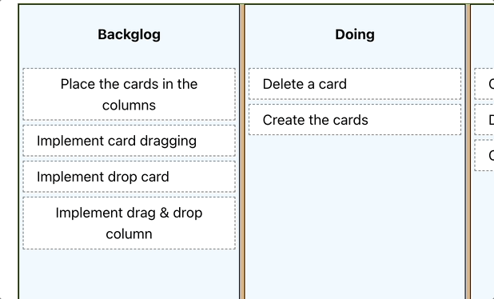

# 03 Drop

We are going to implement the drop functionality. Which one do you think should be the _droppable_ area?

Surely, the first thing that comes to mind is the columns... that makes perfect sense (or not? :) )



In this example, we will make the columns droppable, and when an element is dropped in a column, it will be added to the list of elements there.

Then we will find an issue and figure out what solution we have to apply (for the sake of simplicity we will not implement that complicated path, although could be a good exercise for the reader).

In the next example, we will revisit and implement the drop functionality on the cards, see what problems are solved by following this approach, and learn the tricks we need to apply (there is no silver bullet).

## Step by Step

We mentioned that we were going to mark the column component as `droppable`, let's go for that:

_./src/kanban/components/column/column.component.tsx_

```diff
- import React from "react";
+ import React, { useState, useEffect, useRef } from "react";
+ import { dropTargetForElements } from "@atlaskit/pragmatic-drag-and-drop/element/adapter";
+ import invariant from "tiny-invariant";
import classes from "./column.component.module.css";
import { CardContent } from "../../model";
import { Card } from "../card/card.component";

interface Props {
  name: string;
  content: CardContent[];
}

export const Column: React.FC<Props> = (props) => {
  const { name, content } = props;
+  const ref = useRef(null);
+  const [isDraggedOver, setIsDraggedOver] = useState(false);

+  useEffect(() => {
+    const el = ref.current;
+    invariant(el);
+
+    return dropTargetForElements({
+      element: el,
+      onDragEnter: () => setIsDraggedOver(true),
+      onDragLeave: () => setIsDraggedOver(false),
+      onDrop: () => setIsDraggedOver(false),
+    });
+  }, []);

  return (
-    <div className={classes.container}>
+    <div className={classes.container} ref={ref}
+       style={{backgroundColor: (isDraggedOver) ? "white" : "aliceblue"}}
+>
      <h4>{name}</h4>
      {content.map((card) => (
        <Card key={card.id} content={card} />
      ))}
    </div>
  );
};
```

What are we doing here?

- `dropTargetForElements` is a function that allows us to mark an element as droppable.
- We use the events `onDragEnter`, `onDragLeave`, and `onDrop` to change the background color of the column container, indicating that we can drop content there.

Looks good, right? But if we try to drop, you'll see that nothing happens. 


We need to do the following:

- First, know which card we are talking about.
- Second, know which column we are in.

After all, behind the scenes, we have an array of columns, each of them containing an array of cards.

First, let’s store the information about the card we are dragging. To do this, we will inform Pragmatic drag and drop about _id_ of the card that we are dragging, in order to make that weill use the `getInitialData` property use in the `draggable` function param (we could also store the column to make it easier).

_./src/kanban/components/card/card.component.tsx_

```diff
export const Card: React.FC<Props> = (props) => {
  const { content } = props;
  const [dragging, setDragging] = useState<boolean>(false);
  const ref = useRef(null);

  useEffect(() => {
    const el = ref.current;

    invariant(el);

    return draggable({
      element: el,
+     getInitialData: () => ({ card: content }),
      onDragStart: () => setDragging(true),
      onDrop: () => setDragging(false),
    });
  }, []);
```

By doing this, when we drag, we will have the id of the card that is being dragged.

And the drop? How do we inform about the destination column we are in?

First, let’s pass the id of the column to the column component:

_./src/kanban/components/kanban/column/column.component.tsx_

```diff
interface Props {
+ columnId : number;
  name: string;
  content: CardContent[];
}

export const Column: React.FC<Props> = (props) => {
-  const { name, content } = props;
+ const { columnId, name, content } = props;
```

Let's pass it from the container:

_./src/kanban/kanban.container.tsx_

```diff
  return (
    <div className={classes.container}>
      {kanbanContent.columns.map((column) => (
        <Column key={column.id} name={column.name} content={column.content}
+         columnId={column.id}
        />
      ))}
    </div>
  );
```

Now, in the column, we will inform about the destination column on drop:

_./src/kanban/components/column.component.tsx_

```diff
export const Column: React.FC<Props> = (props) => {
-  const { name, content } = props;
+ const { name, content, columnId } = props;

  const ref = useRef(null);
  const [isDraggedOver, setIsDraggedOver] = useState(false);

  useEffect(() => {
    const el = ref.current;
    invariant(el);

    return dropTargetForElements({
      element: el,
+     getData: () => ({columnId}),
      onDragEnter: () => setIsDraggedOver(true),
      onDragLeave: () => setIsDraggedOver(false),
      onDrop: () => setIsDraggedOver(false),
    });
  }, []);
```

Now we have the information about what we are dragging and the destination where we want to drop it.

Next, we need to detect when the drop has been successfully achieved and update the application state.

To do this the _monitor_ function from the drag-and-drop library is of great help. This allows us to monitor if a drop has occurred and obtain the data of the cardId and the destination column, allowing us to update our application state and add the card to the destination column.

The most logical place to add this monitor is in the _kanban.container.tsx_ since that’s where we have the kanban content state.

To avoid cluttering the container with business logic, we will create a plain TypeScript function to update the card lists (this function is ideal to develop following TDD).

_./src/kanban/kanban.business.ts_

```typescript
import { CardContent, KanbanContent } from "./model";

// Just vanilla TypeScript, no React or Pragmatic Drag and Drop here
// This could be implemented in a more optimal way

const removeCardFromColumn = (
  card: CardContent,
  kanbanContent: KanbanContent
): KanbanContent => {
  const newColumns = kanbanContent.columns.map((column) => {
    const newContent = column.content.filter((c) => c.id !== card.id);

    return {
      ...column,
      content: newContent,
    };
  });

  return {
    ...kanbanContent,
    columns: newColumns,
  };
};

const addCardToColumn = (
  card: CardContent,
  columnId: number,
  kanbanContent: KanbanContent
): KanbanContent => {
  const newColumns = kanbanContent.columns.map((column) => {
    if (column.id === columnId) {
      return {
        ...column,
        content: [...column.content, card],
      };
    }
    return column;
  });

  return {
    ...kanbanContent,
    columns: newColumns,
  };
};

export const moveCard = (
  card: CardContent,
  destinationColumnId: number,
  kanbanContent: KanbanContent
): KanbanContent => {
  const newKanbanContent = removeCardFromColumn(card, kanbanContent);
  return addCardToColumn(card, destinationColumnId, newKanbanContent);
};
```

Let's now use this function in the container:

Note that in the `useEffect`, we specify that it gets triggered when `kanbanContent` changes. We do this to avoid working with outdated `kanbanContent` data, ensuring proper updates.

_./src/kanban/kanban.container.tsx_

```diff
import {
+  CardContent,
  KanbanContent,
  createDefaultKanbanContent,
} from "./model";
import { loadKanbanContent } from "./api";
import { Column } from "./components/column/";
+ import { monitorForElements } from "@atlaskit/pragmatic-drag-and-drop/element/adapter";
+ import { moveCard } from "./kanban.business";
// (...)

export const KanbanContainer: React.FC = () => {
  const [kanbanContent, setKanbanContent] = React.useState<KanbanContent>(
    createDefaultKanbanContent()
  );

  React.useEffect(() => {
    loadKanbanContent().then((content) => setKanbanContent(content));
  }, []);

+  React.useEffect(() => {
+    return monitorForElements({
+      onDrop({ source, location }) {
+        const destination = location.current.dropTargets[0];
+        if (!destination) {
+          // if dropped outside any target
+          return;
+        }
+
+        const card = source.data.card as CardContent;
+        const columnId = destination.data.columnId as number;
+
+        // Just to ensure we are working with the latest state (that why use the function form)
+        setKanbanContent((kanbanContent) =>
+          moveCard(card, columnId, kanbanContent)
+        );
+      },
+    });
+  }, [kanbanContent]);

   return (
     <div className={classes.container}>
```

Let's modify the business logic to place the card at the end of the column for the card id value -1.

Is time to modify the business function. To avoid too much complexity with immutable updates, we will install the _immer_ library.

```bash
npm install immer
```

_./src/kanban/kanban.business.ts_

```diff
- import { CardContent, KanbanContent } from "./model";
+ import { CardContent, Column, KanbanContent } from "./model";
+ import { produce } from "immer";

// (...)

+  const dropCardAfter = (
+    origincard: CardContent,
+    destinationCardId: number,
+    destinationColumn: Column
+  ): Column => {
+    if (destinationCardId === -1) {
+      return produce(destinationColumn, (draft) => {
+        draft.content.push(origincard);
+      });
+    }
+
+    return produce(destinationColumn, (draft: { content: CardContent[] }) => {
+      const index = draft.content.findIndex(
+        (card: { id: number }) => card.id === destinationCardId
+      );
+      draft.content.splice(index, 0, origincard);
+    });
+  };

const addCardToColumn = (
  card: CardContent,
  columnId: number,
  kanbanContent: KanbanContent
): KanbanContent => {
  const newColumns = kanbanContent.columns.map((column) => {
-    if (column.id === columnId) {
-      return {
-        ...column,
-        content: [...column.content, card],
-      };
-    }
+    if (column.id === columnId) {
+      return dropCardAfter(card, -1, column);
+    }
    return column;
  });

  return {
    ...kanbanContent,
    columns: newColumns,
  };
};
```

If we now try it

```bash
npm run dev
```

It seems to work well; we can drag and drop, but...

The devil is in the details. What if we want to insert the card between two existing ones instead of appending the card at the bottom of the column? right now, it always adds it at the end.

This becomes tricky. How could we solve it?

- Capture the mouse position when the drop occurs.
- Save an array of refs for the divs containing each card in the destination column.
- Iterate through them and check if the mouse position is inbetween two elements.
- Insert it there (and if it’s below the last card, add it to the end, the same with the top scenario).

This is quite complex. Could we make it easier? Yes! If instead of dropping on columns, why don't we drop on cards?

- We could easily insert the cards.
- For the bottom part of the column (if there is blank space available), we could create an invisible card to occupy that space and serve as a drop area.

> If we want to refine more, we can split the card into three areas to see if we should drop it right before the top or after the bottom of the card.

We will see this in the next example.
