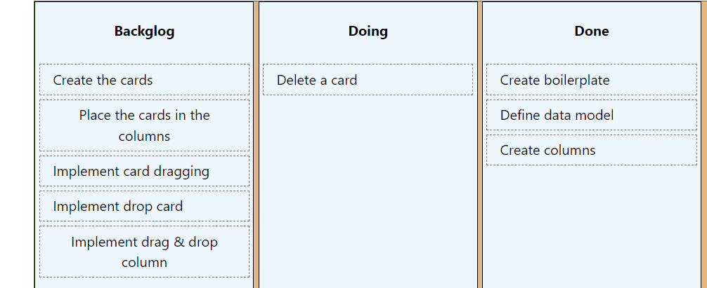

# 04 Drop Card

Vamos a implementar el area de drop en las cards, así podremos intercalar cards al soltaras.


## Paso a paso

Partimos del ejemplo anterior, lo copiamos, instalamos dependencias y ejecutamos el proyecto.

```bash
npm install
```

```bash
npm run dev
```

Para hacernos más fácil buscar en que columna queremos hacerle el drop a la card, vamos a pasar el id de la columna al componente card:

_./src/kanban/components/card/card.component.tsx_

```diff
interface Props {
+ columnId: number;
  content: CardContent;
}

export const Card: React.FC<Props> = (props) => {
-  const { content } = props;
+  const { content, columnId } = props;
  const [dragging, setDragging] = useState<boolean>(false);
  const ref = useRef(null);
```

_./src/kanban/components/column/column.component.tsx_

```diff
  {content.map((card) => (
    <Card
      key={card.id}
      content={card}
+     columnId={columnId}
    />
  ))}
```

Ahora que lo tenemos lo único que vamos a hacer es quitar el drop de la columna y pasarlo a la card (informandole la columna).

_./src/kanban/components/column/column.component.tsx_

```diff
- import React, { useState, useEffect, useRef } from "react";
+ import React from "react";
- import invariant from "tiny-invariant";
- import { dropTargetForElements } from "@atlaskit/pragmatic-drag-and-drop/element/adapter";
import classes from "./column.component.module.css";
import { CardContent } from "../../model";
import { Card } from "../card/card.component";
```

```diff
export const Column: React.FC<Props> = (props) => {
  const { name, content, columnId } = props;
-  const ref = useRef(null);
-  const [isDraggedOver, setIsDraggedOver] = useState(false);

-  useEffect(() => {
-    const el = ref.current;
-    invariant(el);
-
-    return dropTargetForElements({
-      element: el,
-      getData: () => ({columnId}),
-      onDragEnter: () => setIsDraggedOver(true),
-      onDragLeave: () => setIsDraggedOver(false),
-      onDrop: () => setIsDraggedOver(false),
-    });
-  }, []);
```

```diff
  return (
    <div
      className={classes.container}
-      ref={ref}
-      style={{ backgroundColor: isDraggedOver ? "white" : "aliceblue" }}
    >
      <h4>{name}</h4>
      {content.map((card) => (
        <Card key={card.id} content={card} />
      ))}
    </div>
  );
```

Y vamos a añadirlo al card, pero esta vez le indicamos también el card Id destino.

_./src/kanban/components/card/card.component.tsx_

```diff
import React from "react";
import { useEffect, useRef, useState } from "react";
- import { draggable } from "@atlaskit/pragmatic-drag-and-drop/element/adapter";
+ import { draggable, dropTargetForElements } from "@atlaskit/pragmatic-drag-and-drop/element/adapter";
import { CardContent } from "../../model";
import classes from "./card.component.module.css";
import invariant from "tiny-invariant";
```

```diff
export const Card: React.FC<Props> = (props) => {
  const { content } = props;
  const [dragging, setDragging] = useState<boolean>(false);
+ const [isDraggedOver, setIsDraggedOver] = useState(false);
  const ref = useRef(null);

  useEffect(() => {
    const el = ref.current;

    invariant(el);

    return draggable({
      element: el,
      getInitialData: () => ({ card: content }),
      onDragStart: () => setDragging(true),
      onDrop: () => setDragging(false),
    });
  }, []);

+  useEffect(() => {
+    const el = ref.current;
+    invariant(el);
+
+    return dropTargetForElements({
+      element: el,
+      getData: () => ({columnId, cardId: content.id}),
+      onDragEnter: () => setIsDraggedOver(true),
+      onDragLeave: () => setIsDraggedOver(false),
+      onDrop: () => setIsDraggedOver(false),
+    });
+  }, []);

  return (
    <div
      ref={ref}
      className={classes.card}
      style={{
        opacity: dragging ? 0.4 : 1,
+        background: isDraggedOver ? "lightblue" : "white",
      }}
    >

```

Y en el monitor, tenemos que tener en cuenta el nuevo campo _cardId_ para intercarlo en el drop.

_./src/kanban/kanban.container.tsx_

```diff
  React.useEffect(() => {
    return monitorForElements({
      onDrop({ source, location }) {
        const destination = location.current.dropTargets[0];
        if (!destination) {
          // si se suelta fuera de cualquier target
          return;
        }

        const card = source.data.card as CardContent;
        const columnId = destination.data.columnId as number;
+       const destinationCardId = destination.data.cardId as number;
        // También aquí nos aseguramos de que estamos trabajando con el último estado
        setKanbanContent((kanbanContent) =>
-          moveCard(card, columnId, kanbanContent)
+          moveCard(card, {columnId, cardId: destinationCardId}, kanbanContent)
        );
      },
    });
  }, [kanbanContent]);

```

Toca modificar la función de negocio, para no liarnos demasiado con actualizaciones inmutables, vamos a usar la librería _immer_.

```bash
npm install immer
```

Y ahora en negocio:

_./src/kanban/kanban.container.business.ts_

```diff
+ type DropArgs = {columnId : number, cardId: number};

export const moveCard = (
  card: CardContent,
-  destinationColumnId: number,
+  dropArgs: DropArgs,
  kanbanContent: KanbanContent
): KanbanContent => {
 const newKanbanContent = removeCardFromColumn(card, kanbanContent);
- return addCardToColumn(card, destinationColumnId, newKanbanContent);
+ return addCardToColumn(card, dropArgs, newKanbanContent);
};
```

```diff
- import { CardContent, KanbanContent } from "./model";
+ import { CardContent, Column, KanbanContent } from "./model";
+ import { produce } from "immer";
// (...)

 const dropCardAfter = (
  origincard: CardContent,
  destinationCardId: number,
  destinationColumn: Column,
 ): Column => {
-  if (destinationCardId === -1) {
-    return produce(destinationColumn, (draft) => {
-      draft.content.push(origincard);
-    });
-  }

-  return produce(destinationColumn, (draft: { content: CardContent[] }) => {
-    const index = draft.content.findIndex(
-      (card: { id: number }) => card.id === destinationCardId
-    );
+  return produce(destinationColumn, (draft) => {
+    const index = draft.content.findIndex((card) => card.id === destinationCardId);
     draft.content.splice(index, 0, origincard);
   });
 };

 const addCardToColumn = (
   card: CardContent,
-  columnId: number,
+  dropArgs: DropArgs,
   kanbanContent: KanbanContent
 ): KanbanContent => {
   const newColumns = kanbanContent.columns.map((column) => {
-    if (column.id === columnId) {
-      return dropCardAfter(card, -1, column);
+    if (column.id === dropArgs.columnId) {
+      return dropCardAfter(card, dropArgs.cardId, column);
     }
     return column;
   });

   return {
     ...kanbanContent,
     columns: newColumns,
   };
 };
```

Probamos

```
npm run dev
```

Parece que fucniona, peeeerooo si soltamos al card en el fondo de la columna podemos ver que no se hace el drop ¿Qué pasa aquí? Pues que ahí no ha zona de drop, lo arreglamos creando una especia de card vacía en el fondo de la columna que ocupe todo el espacio libre.



Vamos a hacer un cosa la pintamos de un color para que se distinga, despues le aplicaremos color transparente.

_./src/kanban/components/empty-space-drop-zone.component.tsx_

```tsx
import React from "react";
import { useEffect, useRef } from "react";
import { dropTargetForElements } from "@atlaskit/pragmatic-drag-and-drop/element/adapter";
import invariant from "tiny-invariant";

interface Props {
  columnId: number;
}

export const EmptySpaceDropZone: React.FC<Props> = (props) => {
  const { columnId } = props;
  const ref = useRef(null);

  useEffect(() => {
    const el = ref.current;
    invariant(el);

    return dropTargetForElements({
      element: el,
      getData: () => ({ columnId, cardId: -1 }),
    });
  }, []);

  return (
    <div ref={ref} style={{ flexGrow: 1, width: "100%", background: "blue" }} />
  );
};
```

Vamos a añadirlo al final de cada columna:

_./src/kanban/components/column/column.component.tsx_

```diff
import classes from "./column.component.module.css";
import { CardContent } from "../../model";
import { Card } from "../card/card.component";
+ import { EmptySpaceDropZone } from "../empty-space-drop-zone.component";

interface Props {
  columnId: number;
  name: string;
  content: CardContent[];
}

export const Column: React.FC<Props> = (props) => {
  const { name, content, columnId } = props;

  return (
    <div className={classes.container}>
      <h4>{name}</h4>
      {content.map((card) => (
        <Card key={card.id} content={card} columnId={columnId} />
      ))}
+     <EmptySpaceDropZone columnId={columnId} />
    </div>
  );
};
```

Ahora probamos y a lo tenemos.

Vamos a poner el color transparente

_./src/kanban/components/empty-space-drop-zone.component.tsx_

```diff
  return (
    <div ref={ref} style={{ flexGrow: 1,
                            width: "100%",
-                            background: "blue"
+                            background: "transparent"
                            }} />
  );
```

Siguientes pasos, ... el objetivo de este ejemplo es que te familiarices con esta librería de drag & drop, ¿Cómo se podría mejorar?

- Intercalar card fantasma en el drop.
- En los cards definiendo dos areas de drop, una que haga que suelte la card arriba y otra que la suelte abajo.
- Implementando el scroll automático cuando se acerque a los bordes de la pantalla.
- Haciendo el drag and drop accesible.
- También es buena idea implementar más operaciones:
  - Añadir Card.
  - Eliminar Card.
  - Modificar Card.
- Otra opción es crear una card más rica.
