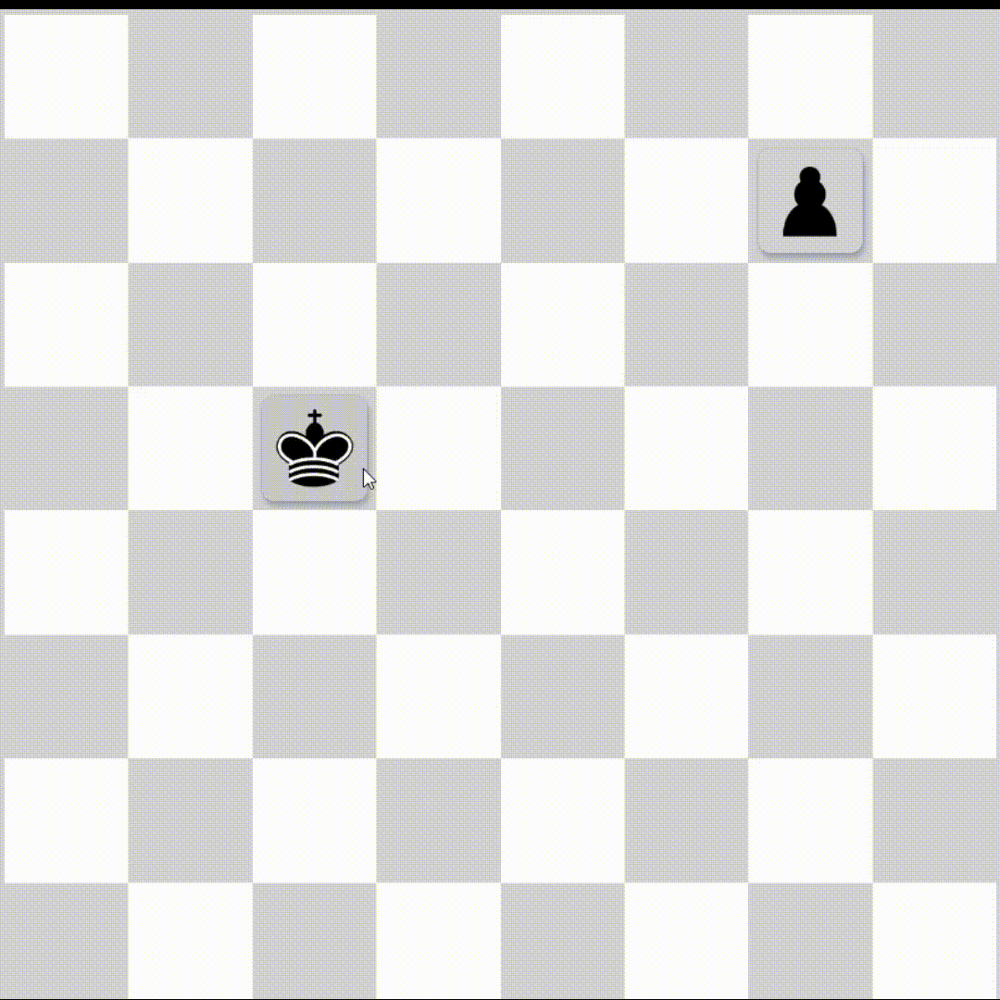

# Paso 3: Mover las piezas

Finalmente, vamos a permitir que las piezas se muevan a otras casillas cuando se suelten. Para lograr esto, usaremos `monitorForElements` de Pragmatic drag and drop.

Los monitores te permiten observar interacciones de arrastrar y soltar desde cualquier lugar en tu código. Esto permite recibir datos de elementos arrastrables y de los objetivos de soltado (targets) y realizar operaciones sin necesidad de pasar estado entre componentes.

Por lo tanto, podemos colocar un monitor dentro de un `useEffect` en el nivel superior de nuestro tablero de ajedrez y escuchar cuando las piezas se sueltan en las casillas.

Para lograr esto, primero necesitamos exponer la ubicación de las casillas dentro del objetivo de soltado, como hicimos para las piezas arrastrables en el paso anterior:



_./src/board/components/square.component.tsx_

```diff
  const ref = useRef(null);
  const [state, setState] = useState<HoveredState>("idle");

  useEffect(() => {
    const el = ref.current;
    invariant(el);

    return dropTargetForElements({
      element: el,
+     getData: () => ({ location }),
      canDrop: ({ source }) => {
```

Luego añadimos un monitor al tablero de ajedrez. Gran parte de esta lógica refleja lo explicado anteriormente para colorear las casillas.

_./src/board.component.tsx_

```diff
+ import { useEffect, useState } from "react";
+ import { monitorForElements } from "@atlaskit/pragmatic-drag-and-drop/element/adapter";
import { PieceRecord } from "./board.model";
import { renderSquares } from "./components";
import styles from "./board.module.css";
+ import { canMove, isCoord, isEqualCoord, isPieceType } from "./board.utils";

export function Chessboard() {
-  const pieces: PieceRecord[] = [
-    { type: "king", location: [3, 2] },
-    { type: "pawn", location: [1, 6] },
-  ];
+  const [pieces, setPieces] = useState<PieceRecord[]>([
+    { type: 'king', location: [3, 2] },
+    { type: 'pawn', location: [1, 6] },
+  ]);

+  useEffect(() => {
+      return monitorForElements({
+        onDrop({ source, location }) {
+          const destination = location.current.dropTargets[0];
+          if (!destination) {
+            // si se suelta fuera de cualquier target
+            return;
+          }
+          const destinationLocation = destination.data.location;
+          const sourceLocation = source.data.location;
+          const pieceType = source.data.pieceType;
+
+          if (
+            // comprobaciones de tipo
+            !isCoord(destinationLocation) ||
+            !isCoord(sourceLocation) ||
+            !isPieceType(pieceType)
+          ) {
+            return;
+          }
+
+          const piece = pieces.find(p =>
+            isEqualCoord(p.location, sourceLocation),
+          );
+          const restOfPieces = pieces.filter(p => p !== piece);
+
+          if (
+            canMove(sourceLocation, destinationLocation, pieceType, pieces) &&
+            piece !== undefined
+          ) {
+            // moviendo la pieza
+            setPieces([
+              { type: piece.type, location: destinationLocation },
+              ...restOfPieces,
+            ]);
+          }
+        },
+      });
+    // Añadir 'pieces' como dependencias garantiza que el efecto se vuelva a ejecutar
+    // cada vez que la ubicación o las piezas cambien, manteniendo actualizada la lógica del target.
+    }, [pieces]);

  return <div className={styles.board}>{renderSquares(pieces)}</div>;
}
```
