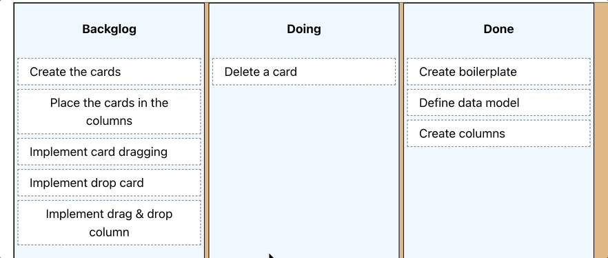

# 🧩 Pragmatic Drag & Drop Examples

Welcome to the Pragmatic Drag & Drop Examples repository! This project aims to simplify and enhance the learning experience for developers exploring the [Pragmatic Drag & Drop](https://github.com/atlassian/pragmatic-drag-and-drop) library by Atlassian.

- 🇪🇸: [Guide in Spanish](https://github.com/Lemoncode/pragmatic-drag-and-drop-tutorial-typescript/blob/main/README_ES.md)

## 📝 Overview

The Pragmatic Drag & Drop library by Atlassian is a powerful tool for implementing drag-and-drop functionality in web applications. In their [tutorial section](https://atlassian.design/components/pragmatic-drag-and-drop/tutorial), Atlassian provides interesting examples using a chessboard to explain the basics of drag-and-drop.

However, these examples have some drawbacks:

- 📄 The code is a bit hard to follow because everything is in a single file.
- 💄 The examples use the Emotion library for CSS, which can be distracting due to the additional dependencies.
- 🛠️ If you download the code from CodeSandbox to run locally, you may encounter issues during installation and execution due to version conflicts.

## 🔧 What Have We Done?

To address these issues, we have:

- 🧹 Simplified the example by removing unnecessary dependencies, such as Emotion, and using plain CSS instead.
- 📂 Organized the project into folders and files to make the code more modular and easier to understand.
- 📚 Created step-by-step guides in markdown format for each example, allowing you to reproduce the examples easily.
- 🆕 Added new examples such as a simple Kanban board so you can see how to apply the library without getting distracted by implementation details.

We hope these improvements will make it easier for you to follow along and learn how this fantastic library works.

## Examples implemented

### Chessboard


This [example is taken from its original tutorial](https://atlassian.design/components/pragmatic-drag-and-drop/tutorial). What are the differences from the original?

    - The Emotion dependency has been removed and simple CSS has been used.

    - The code has been organized into folders and files to make it more modular and easier to understand.

    - A step-by-step guide in markdown format has been created so you can easily reproduce the example.

    - The guide is also translated into Spanish so you can follow the example in your native language.

### Simple Kanban Board



This example shows how to implement a simple Kanban board. The goal of this codebase is to help you focus on what the library offers without getting distracted by details (if you're looking for a more refined solution, you can check out the fantastic [Demo provided by Pragmatic Drag And Drop](https://atlassian.design/components/pragmatic-drag-and-drop/examples) ).

What has been implemented:

    - A starting point (columns and cards are displayed).

    - How to drag the cards.

    - How to drop in the columns (and why the solution is not entirely good).

    - How to drop on the cards.

    - How to show a _ghost_ card while dragging to indicate where the card will be dropped.

> This Kanban is a `Work in Progress`. Currently, five steps have been implemented, and more improvements will be added in the future.

## 🔮 Future Improvements

- Additional explanations and details will be added to further enhance the learning experience.
- Add more example extending the current tutorial.

## 🛠️ Getting Started

To get started with the examples, clone this repository and follow the instructions provided in the respective markdown guides.

Clone the repo

```sh
git clone https://github.com/Lemoncode/pragmatic-drag-and-drop-tutorial-typescript.git
```

Now you can for instance open example `00-starter-code`

```sh
cd 00-starter-code
```

Install the dependencies

```sh
npm install
```

Run the project

```sh
npm run dev
```

Now you can open your browser and go to `http://localhost:5173` to see the project.

And starting building the next step by following the guide located in:

https://github.com/Lemoncode/pragmatic-drag-and-drop-tutorial-typescript/blob/main/01-step-1-pieces-draggable/README.md

Follow the step-by-step guides in the guides directory for each example.

## 🤝 Contributing

We welcome contributions! If you have any improvements or new examples to add, please feel free to open a pull request.

## 📜 License

This project is licensed under the MIT License - see the LICENSE file for details.

---

We hope you find these examples helpful and enjoy learning how to use the Pragmatic Drag & Drop library!

Happy coding!
